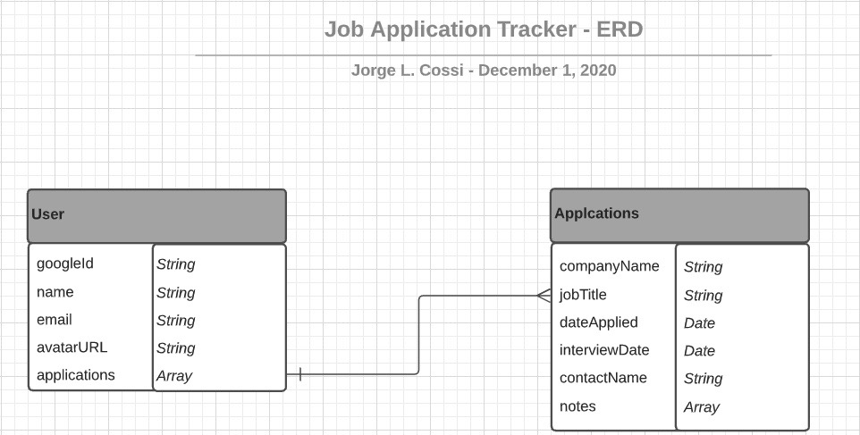
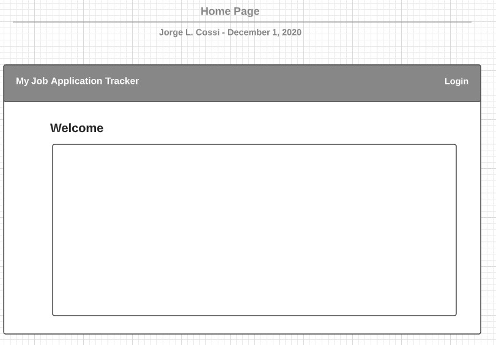
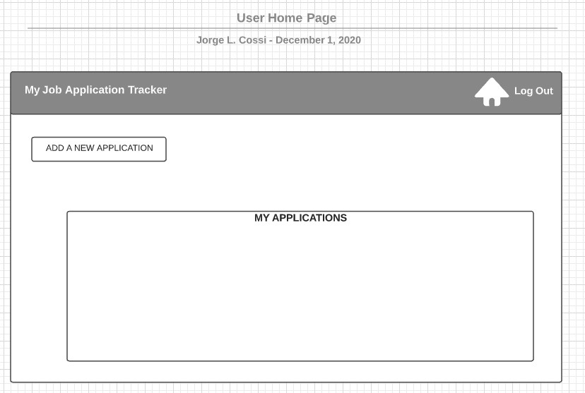
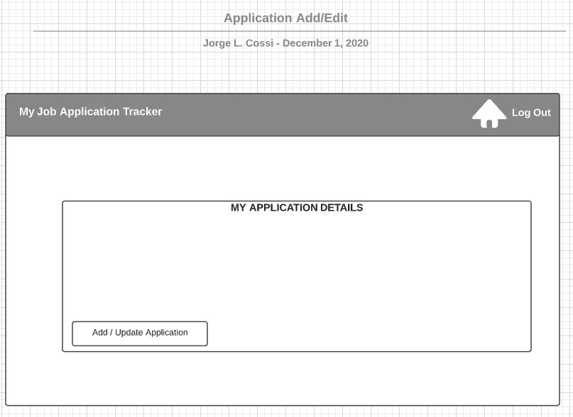

## My Job Application Tracker

This app can be used to track all the job applications submitted during a job seach.  You will be able to:
* Login using Google OAuth
* Add the following information about the job you applied for:
  * Company Name
  * Position Applied For
  * Date Applied (optional)
  * Interview Date (optional)
  * Name of Contact at Company (optional)
  * Notes about application (optional)
* Application info will persist even after you've logged out
* Edit or Delete application entry

## Entity Relationship Diagram
 

## Wireframe
 

 

 

## Technologies Used
* HTML5
* CSS3
* JavaScript
* Google Fonts
* Materialize

## Getting Started
Click [here](https://my-job-application-tracker.herokuapp.com/) to get started. 
 

## Future Enhancements
- [] Allow user to start search popular job sites from within application
- [] Allow user to login using LinkedIn login info